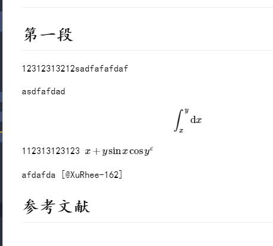

# 摘要{-}

# 目录在摘要后方，需要手动调整

## 二级标题{#sec:2}

这里有一个章节的引用，下面一段引用这里的章节号 [@于秀清-213]

# 一级标题

@sec:2{nolink=True}你平时经常写学术论文吗？用的是什么工具？效率如何？除了本文介绍的方法外，有没有更好的工具和流程推荐给大家？欢迎留言，分享你的思考和经验，我们一起交流讨论。

如果你对我的文章感兴趣，欢迎点赞，并且关注我的专栏，以便收到后续作品更新通知。 

## 二级标题

如果本文可能对你身边的亲友有帮助，也 \t 欢迎你把本文通过微博或朋友圈分享给他们。让他们一起参与到我们的讨论中来。

作者：王树义
链接：https://www.jianshu.com/p/b0ac7ae98100
来源：简书

### 三级标题

著作权归作者所有。商业转载请联系作者获得授权，非商业转载请注明出处。

dfdf123
  ~ 123

❗❌Term 1
  ~ Definition 1

Term 2
  ~ Definition 2a
  ~ Definition 2b

### 三级标题

```
1   
23
23
```

123[1]

[1]: 123

> [before:]
> 
> 123


[before:] : 123

* here is my first   
  list item.
* and my second.

你平时经常写学术论文吗？用的是什么工具？效率如何？除了本文介绍的方法外，有没有更好的工具和流程推荐给大家？欢迎留言，分享你的思考和经验，我们一起交流讨论。

* fruits
  + apples
    - macintosh
    - red delicious
  + pears
  + peaches
* vegetables
  + broccoli
  + chard

*     code

  continuation paragraph

123111111111111111111

  * First paragraph.

    Continued.

  * Second paragraph. With a code block, which must be indented
    eight spaces:

        { code }

---

<div id="fig:figureRef">
{#fig:figureRefA}

{#fig:figureRefB}

Caption of figure
</div>

+ A lazy, lazy, list
item.

+ Another one; this looks
bad but is legal.

    Second paragraph of second
list item.

### 有序列表

 9)  Ninth
10)  Tenth
11)  Eleventh
       i. subone
      ii. subtwo
     iii. subthree

|   1   |    2    |
| :---: | :-----: |
| * 123 |  * 123  |
|       | 1. 123  |
|       | 2. 456  |
|       | (@) 123 |
|       | (@) 123 |


(2) Two
(5) Three
1.  Four
*   Five


- [ ] an unchecked task list item
- [x] checked item

---

123(@good)

(#)  My first example will be numbered (5).
(@)  My second example will be numbered (2).

Explanation of examples.

(@)  My third example will be numbered (3).

(@good)  This is a good example.

As (@good) illustrates, ...

## 二级标题

如果你对我的文章感兴趣，欢迎点赞，并且关注我的专栏，以便收到后续作品更新通知。

{#fig:pic_test width=5cm}

如果本文可能对你身边的 {#eq} 亲友有帮助，也欢迎你把本文通过微博或朋友圈分享给他们。让他们一起参与到我们的讨论中来。

$$ \begin{aligned} P\left(\left|\frac{\bar{X}-\mu}{\sigma / \sqrt{n}}\right| \leq \frac{u-\mu}{\sigma / \sqrt{n}}\right) &=P(\sqrt{3 n}|\bar{X}| \leq \sqrt{3 n} * u) \\&= P(-\sqrt{3 n} * u \leq \sqrt{3 n} \bar{X} \leq \sqrt{3 n} * u) \\&= \Phi(\sqrt{3 n} * u)-\Phi(-\sqrt{3 n} * u) \\&= \Phi(\sqrt{3 n} * u)-(1-\Phi(\sqrt{3 n} * u)) \\&= 2 \Phi(\sqrt{3 n} * u)-1 \end{aligned} $$

作者：王树义
链接：https://www.jianshu.com/p/b0ac7ae98100

### 三级标题

来源：简书
著作权归作者所有。商业转载请联系作者获得授权，非商业转载请注明出处。

## English test

12312313212sadfafafdaf

{#fig:pic width=6cm}

asd{!eq:id}fafd {@fig:pic}{nolink=True}ad $E(x)=\frac{a+b}{2}=0, D(x)=\frac{(b-a)^{2}}{12}=\frac{1}{3}$  ，则：$$ \begin{aligned} P\left(\left|\frac{\bar{X}-\mu}{\sigma / \sqrt{n}}\right| \leq \frac{u-\mu}{\sigma / \sqrt{n}}\right) &=P(\sqrt{3 n}|\bar{X}| \leq \sqrt{3 n} * u) \\&= P(-\sqrt{3 n} * u \leq \sqrt{3 n} \bar{X} \leq \sqrt{3 n} * u) \\&= \Phi(\sqrt{3 n} * u)-\Phi(-\sqrt{3 n} * u) \\&= \Phi(\sqrt{3 n} * u)-(1-\Phi(\sqrt{3 n} * u)) \\&= 2 \Phi(\sqrt{3 n} * u)-1 \end{aligned} $${#eq:id}

112313123123 $x+y \sin x \cos y^\varepsilon$

afdafda [@XuRhee-162]

# 参考文献{-}
